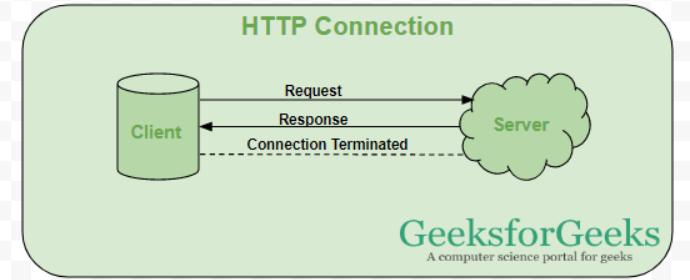

# HTTP
- HTTP is unidirectional, where the client sends the request, and the server sends the response.
- HTTP is a stateless protocol that runs on top of TCP which is a connection-oriented protocol it guarantees the delivery of data packet transfer
- Uses the three-way handshaking methods and re-transmits the lost packets.
- HTTP can run on top of any reliable connection-oriented protocol such as TCP or SCTP.
- HTTP message information encoded in ASCII, each HTTP request message is composed of HTTP protocol version(HTTP/1.1, HTTP/2), HTTP methods (GET/POST, etc.), HTTP headers (content type, content length), host information, etc. and the body which contain the actual message which is being transferred to the server.

# Websockets
- Communication protocol like HTTP/FTP/SMTP.
- It is a stateful protocol, which means the connection between client and server will stay alive until it gets terminated by either party (client or server). After closing the connection by either of the client or server, the connection is terminated from both ends.
- client-server handshaking
- Once the communication link is established and the connections are opened, message exchange will take place in bidirectional mode until the connection persists between client-server. If anyone of them (client-server) dies or decide to close the connection then it is closed by both the party.
- The way in which the socket works is slightly different from how HTTP works, the status code 101 denotes the switching protocol in WebSocket.

# Why websocket?
- Developed after Long polling because of overuse of resources.

# How WebSockets Work (Behind the Scenes)
- Websockets initializes as HTTP request and response. WebSocket connections are established by upgrading an HTTP request/response pair.
- This is done with the help of header such as connection, upgrade

# Data Transfer
- frames means data segments and communication from both side is done in frames.
- **text frame**:- contains text data 
- **binary data frames**:- contains binary data 
- **ping/pong frames**:- are used to check the connection, sent from the server, the browser responds to these automatically.
- there’s also “connection close frame” and a few other service frames.

## Applications
- Chat application
- Gaming application
- Real-time Notification
- Real-time web application: Real-time web application uses a web socket to show the data at client end, which is continuously being sent by the backend server. In WebSocket, data is continuously pushed/transmitted into the same connection which is already open, that is why WebSocket is faster and improves the application performance. 
e.g. in a trading website or bitcoin trading, for displaying the price fluctuation and movement data is continuously pushed by the backend server to the client end by using a WebSocket channel.

# Conclusion
Websockets are faster than HTTP. Many recent websites are using websocket to make web app faster. But use websockets according to need.

[For more reference](https://sookocheff.com/post/networking/how-do-websockets-work/)

# What Socket.IO is
- Socket.IO is a library that enables low-latency, bidirectional and event-based communication between a client and a server.
- 
